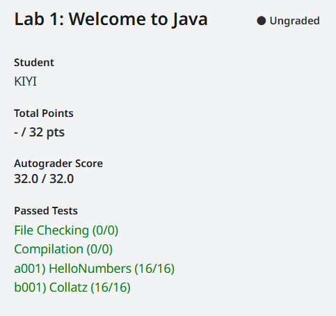

# 前言
目前（2024年8月）已知的有Gradescope（自动评分器）的CS61B版本有14版、18版、21版，其中14和18版已经有点久远，所以我选择学习的CS61B版本是21版的课程。
## 学习顺序
可以参考官方提供的 [Getting Started Guide](https://sp21.datastructur.es/materials/guides/getting-started) 提供了初期的课程顺序，此攻略也将按照这篇建议顺序依次展开
***

## 1、HW0 —— [Basic Java Programs](https://sp21.datastructur.es/materials/hw/hw0/hw0)

此章节介绍了JAVA的部分基本结构与基本语法，对于有编程基础的人基本没什么学习压力，如果是未接触过编程语言的人，建议从头到尾认真学习一遍

如果实在难以理解，建议找点中文的JAVA入门教程看一下，或者先放弃本课程，从[CS61A](https://csdiy.wiki/%E7%BC%96%E7%A8%8B%E5%85%A5%E9%97%A8/Python/CS61A/)学起

对于有编程基础（但不是JAVA，或者较长时间没有使用JAVA）的人，建议也是认真看完，就当复习一下，我就是因为写习惯Python，经常忘记加分号（；）

## 2、Discussion 1 —— [Intro to Java](https://sp21.datastructur.es/materials/discussion/disc01.pdf)
想看就看，没有答案，可略过

## 3、[Lecture 1](https://youtu.be/SixO3uPNAdk) or [Reading 1.1](https://joshhug.gitbooks.io/hug61b/content/chap1/chap11.html) 
建议直接看Reading 1.1，Lecture 1 的视频课程内容量少，大部分时间在讲各种课程设置，助教求助等内容（还有大段时间设置投屏软件），而且语速很快，听起来有点模糊。

Lecture 1 的视频只有在末尾才开始讲课，直接看Reading 1.1效率更高。

##  ★4、Lab 1 Setup —— [Setup: Setting Up Your Computer](https://sp21.datastructur.es/materials/lab/lab1setup/lab1setup.html)
配置环境更耗时，真正的开发.jpg

**以下环境配置皆为Windows 11 系统**

### A. Installing a Text Editor

跳过！！！后面会要求你使用 IntelliJ ，不要在这里浪费时间

### B. Configure Your Computer
#### A. Install Java
直接到 [官网](https://adoptium.net/zh-CN/) 下载最新版本的LTS发行包并按照教程安装就行，没有难度

#### B. Install Git
按照教程来就行，应该没什么难度，如果在安装过程有不太清楚的选项，可以参考[Git 详细安装教程（详解 Git 安装过程的每一个步骤）](https://blog.csdn.net/mukes/article/details/115693833)
#### C. Install Windows Terminal
正常来说，Windows系统自带这个，不需要按教程所说去Microsoft Store安装。可以直接打开“开始”栏（按键盘win键），搜索“终端”即可，有这个应用就是已安装

设置Bash到选项卡中——现在都4202年（？）了，系统都Win 11了，按照[windows11 Windows Terminal 添加 Git-Bash 支持](https://blog.csdn.net/weixin_43872583/article/details/122718552)来就行

**关于 C. Learn to Use the Terminal 与 D. Test Run for your Setup from Step B**

看看、试试就行，等需要用到再请出Google大法

#### E. Install IntelliJ 与 F. Installing the IntelliJ CS 61B Plugins
到[官网](https://www.jetbrains.com/idea/download/?section=windows)下载 社区版！！！ 然后按照教程来就行

社区版的下载位置在往下一些，如图所示的才是社区版的下载位置

**NOTE: IntelliJ 改中文（有坑！！！）**

参考 F. Installing the IntelliJ CS 61B Plugins，搜索“chinese”，就能看到中文插件（可能默认已经安装好了）

安装完成后，随便打开一个项目，左上角打开菜单，在Settings-> Appearance&Behavior-> System Settings-> Language and Region 中可以设置中文

~~新版软件是这样的，不要相信网上什么重启的说法（爱来自重装三次的怨灵）~~

##  ★5、Lab 1 —— [IntelliJ, Java, git](https://sp21.datastructur.es/materials/lab/lab1/lab1.html)
此处的Beacon与Snaps为伯克利学生特供，与我们自学者无关，请自行忽略

### A. Getting the Starter Files 与 E. Pushing Your Work to GitHub
此处采用[快速设置](https://zhuanlan.zhihu.com/p/344813657)的歪门邪道流派，如果想学好git，建议找其他中文教程，课程的设置教程针对性强，许多学生特供步骤，不适合自学者

**附上部分替换与解释：**

[skeleton 2021](https://github.com/Berkeley-CS61B/skeleton-sp21)，用于替换知乎上提供的2018版本

summary 用于填写此次提交的注释，下面的大框Description 是详细注释可以不填，

### B. Running Code in IntelliJ
略

### D. Programming Exercise
skeleton 2021 的 Collatz.java 已有代码，运行后结果为(5，16，32，64，128，1)，删去nextNumber中的代码，自行重写函数逻辑即可

### E. Pushing Your Work to GitHub
再次使用Github Desktop即可

### F. Submitting Lab 1
注册时，填写Spring 2021的邀请码：MB7ZPY，学校：UC Berkeley ,打字打berkeley进行寻找就能找到UC Berkeley，剩下的没难度

如果顺利可以看到如下图片

